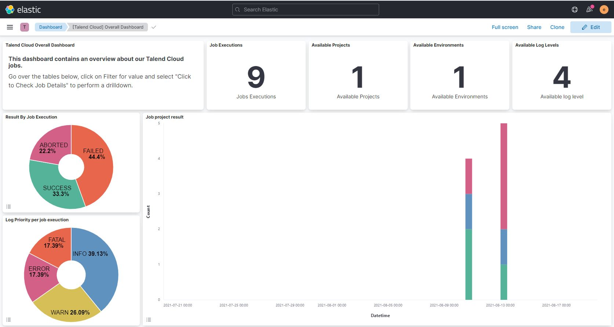
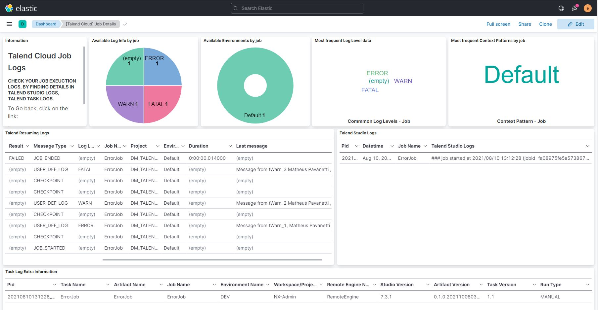
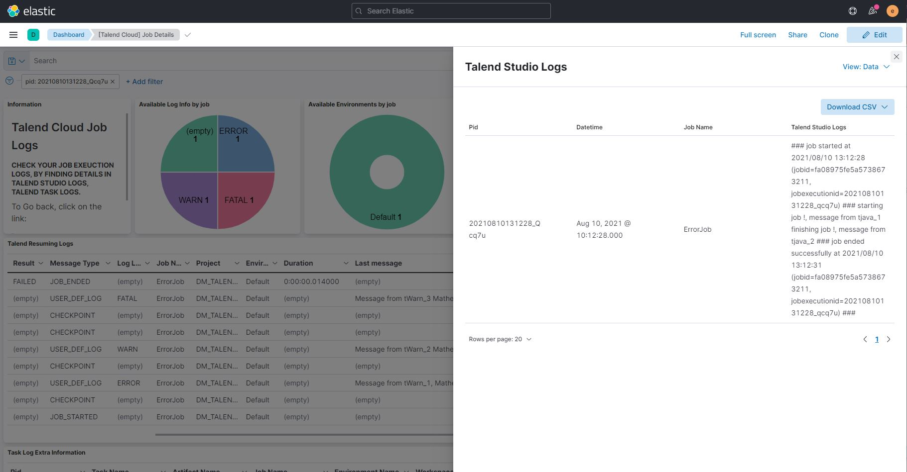
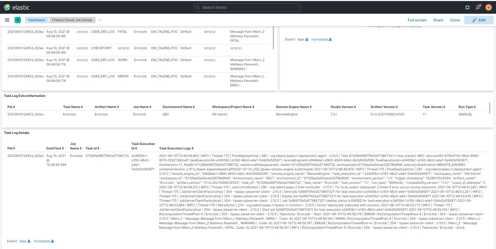

# Python Agent for parsing Talend Remote Engine logs
Script which extracts log files from Talend Remote Engine job logs directory, transform, aggregate and load into elasticsearch indexes.

**Purpose:**

With this python agent running in your talend remote engine windows server, you can have the latest logs updated in your kibana dashboard in real time.
The Talend RE logs are separated in 3 types, **Resuming** logs, containing information about job execution such as statistics,log4j, datetime, events etc, **stdOutErr** which contains Talend Studio java logs, **task** logs containing log4j task logs, those which appear at talend cloud portal (TMC).
The scripts parses the 3 log files and store them in elasticsearch indexes as they arrive.

## Features
1. Extract Resuming, stdOutErr and task logs.
2. Match, Transform, aggregate, calculate metrics from log files.
3. Load clean logs into elasticsearch indexes.
4. Have data ready to be analyzed on kibana dashboards.

## Files
1. [Elasticsearch Index Templates Scripts](Elasticsearch%20Index%20Templates%20for%20Talend%20Logs.md) , commands for creating roles, users and indexes templates in your elasticsearch instance.
2. [Kibana Talend Template](Kibana%20Talend%20Template.ndjson) for importing indexes patterns and kibana dashboards into your kibana instance.
3. [Config.ini](agent/config.ini), file containing python agent configurations.
4. [Install Agent](agent/install_agent.bat), Python Agent installer.

## Installation Steps
1. **[Check Out]** Download or git Clone this repository into a local directory of your preference, ex: D:\ELk\TalendReLogCollector 
2. **[Elasticsearch Commands]** Have access to your Elasticsearch cluster through kibana dev tool or cURL, open up the file [Elasticsearch Index Templates Scripts](Elasticsearch%20Index%20Templates%20for%20Talend%20Logs.md) (github preferred), follow up the instructions and run all the commands in your elasticsearch cluster.
3. **[Kibana Dashboards]** Have access to your kibana instance, open the left side navegation bar, go to Management tab, click on **Stack Management**, then go to Kibana and click on **Saved Objects**, Click on **import** on your right top corner, in the Select a file to import area, drag the file [Kibana Talend Template](Kibana%20Talend%20Template.ndjson) or cliclk import and find this file, in the Import Options, let it as is (Automatically overwrite conflicts) , then finally click in **Import**, ( 7 objects should be imported ) and then **Done** .
4. **[Python Agent]** Go to the folder **agent**, edit the file [Config.ini](agent/config.ini) using notepad, make sure you have all setup following your environment.

	**[config.ini info]**
	On the Application section, you can configure the start trigger, (True for enable the agent and False for disable it), seconds determine how often your talend remote engine logs are checked, let it as is.
	On the Elasticsearch section, you can configure your elasticsearch environment, specifying host, login, password, port, etc.
	On the TalendLogFiles, you can specify your Talend Remote Engine log directory path, don't change the mask parameters.

5. Right click on the file install_agent.bat **RUN AS ADMINISTRATOR**, otherwise it won't work, then the installer takes care for you of prepararing the python virtual environment, installing libraries and deploying the python code as a windows system service. that's it !
6. Check the recent imported kibana dashboards to make sure all of your logs are good so far.

## Start Agent (Manually)
Note, when you install the agent for the first time, it automatically starts the service and setup the service to start with the operating system.
In case you need to start it manually, Navigate to the agent folder Right click on the file start_agent.bat **RUN AS ADMINISTRATOR**, otherwise it won't work, and hit enter once it finishes.

## Stop Agent
Navigate to the agent folder Right click on the file stop_agent.bat **RUN AS ADMINISTRATOR**, otherwise it won't work, and hit enter once it finishes.

## Uninstall Agent
Navigate to the agent folder Right click on the file uninstall.bat **RUN AS ADMINISTRATOR**, otherwise it won't work, and hit enter once it finishes.

## Some Kibana Dashboards Screenshots
Talend Logs Summary Dashboard:
  

Talend Job Details Dashboard:
  

Talend Studio logs (Inspect):
  

Talend Cloud logs:
  

## Kibana Recomendation
I Personally prefer the legacy kibana datatable visualization mode, it's easier to see big column texts.  
You can enable the kibana legacy datatable visualization by opening yout kibana/config/kibana.yml file and adding the following line in the end of the file:
```
vis_type_table.legacyVisEnabled: true
```
After changing that, restart your kibana.  

## Metricbeat Recomendation

I also recommend implementing the elastic beats such as MetricBeat, this is a nice and powerful system metrics log collector, this combined with the python agent is great.
[Elastic Metricbeat](https://www.elastic.co/pt/beats/metricbeat)
  
Metricbeat Screenshot:


## Future Releases Notes
1. Record video and share screenshoots.
2. Implement Bash scripts for linux.
3. Implement encryption or keystore for Elasticsearch password vault in config.ini file.
4. Implement logger in python methods for logging and debugging porpuse.
5. Implement kibana alerts for kibana paid version.
6. Improve Kibana dashboards.

## Credits
Matheus Pavanetti - 2021  
(matheuspavanetti@gmail.com)

## Contributors
New Contributors are always welcome !

## Notes
As this is a beta version, bugs may be found, if you find some, please report immediatly !
Feel free to change the elasticsearch talend user password !

Thank you !

